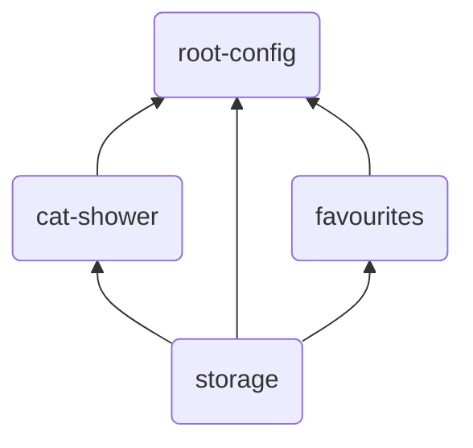

# Microfrontends with single-spa

## Getting Started
Run each project separately: 
`cd` to each project (`root-config`, `cat-shower`, `favourites-svelte` and `storage`) 
and run: 
```
npm install
npm start
```

Open [http://localhost:9000](http://localhost:9000) to view it in the browser.

Overview over ports:
| App                | Port    |
| -------------      | ------- |
| root-config        | 9000    |
| cat-shower         | 3001    |
| favourites-svelte  | 3002    |
| storage            | 3003    |

It should possible to run each application in standalone. But now they are all dependent on `storage` module, so I'm not sure how it's done.

### Composition

* `root-config` is a __single-spa root config__ (shell-app) that imports the other apps.
* `cat-shower` and `favourites-svelte` are __single-spa applications__ (microfrontends) that are imported by `root-config`.
* `storage` is a __in-browser utility module__ that is used by `cat-shower` and `favourites-svelte`.




## Thoughts

1. No common state mamangement, each app has its own state management. Apps should be able to run independently.
2. It's possible to use events emitting and listening to communicate between apps. For example as in this project: 
   * `cat-shower` emits an event when a breed is being added to favourites.
   * `favourites-svelte` listens to the event and adds the breed to the list of favourites.
3. `create-single-spa` is a CLI tool to bootstrap a single-spa application. It doesn't seem to be properly supported yet.
   * Vue application won't run in vue v.3. Fixed that, but got another problem when importing utils from storage project.
   * Same problem with Vue v.2 with utils. 
   * React versions are old.
   * Svelte won't run in standalone mode.
   * Svelte doesn't build from the box. Some dependencies are conflicting.
   * Use vite-single-spa?
4. The way application is build is not optimal. The apps should be independent as much as possible. But here they are dependent on each other:
   * `cat-shower` and `favourites-svelte` are dependent on `storage` module.
   * `cat-shower` and `favourites-svelte` are dependent on each other with events(but could manage to run standalone). 
This is a bad pratice I guess, but I wanted to make the same functionality as in Dog Chooser with module federation.
5. Security conserns?
6. Styling is not consistent in this project because I didn't want to spend too much time on it. But I'm sure it's possible to create a better structure.
7. One should be more expert on webpack to make everything properly. The create-single-spa tool is not supported enough yet.


